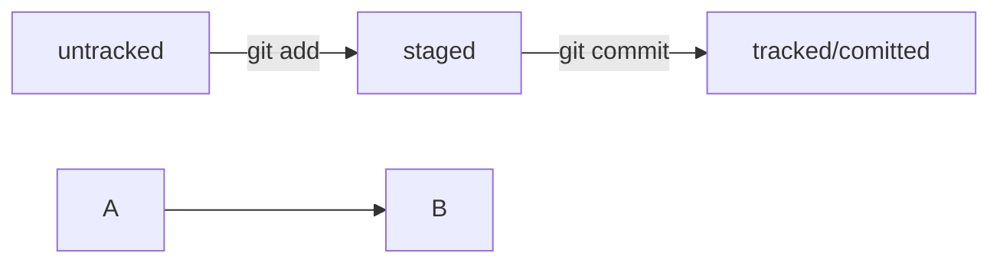

# Список команд

cd ~ Вернуться в корневую директорию

cd .. Вернуться на уровень выше

ls Вывод всех файлов в папке

git commit -m Создание коммита с комментарием

mkdir Создание папки

touch Создание файла

rm Удаление файла

git remote add origin https://github.com/Negroni888/third-project.git Связать репозитории на ПК с GitHub

git remote -v Убедиться что репозитории связаны

git push отправить изменения на удалённый репозиторий

git log просмотреть историю сделанных коммитов

# Как добавить изменения в GitHub
1. Внести изменения в тексовый файл и сохранить

2. cd *имя файла*

3. git add -- *Имя файла*

4. git commit -m 'Комментарий'

5. git push

6. git status

git commit --amend --no-edit Дополнить коммит новыми файлами без изменения сообщения

git commit --amend -m "Обновлённое сообщение коммита" Изменение сообщения коммита

# Информация о логах, хэшах и статусе файлов

git status Вывод информации о любом объекте в Git

HEAD Служебный файл в папке .git указывающий на самый свежий коммит

# Mermaid-схема

# Корректировка файлов и коммитов

git restore --staged *имя файла* Убрать файл из "Staged" обратно в "Untracked"

git restore --staged . Убрать ВСЕ файлы внутри папки из "Staged" обратно в "Untracked"

git reset --hard *хэш коммита* Сделать коммит крайним. Последний коммит при этом будет удалён.

git restore *Имя файла* В случае если внёс изменния в файл в который не нужно было и закоммитил его. Всё вернётся до последней версии. 

git diff сравнивает последнюю закоммиченную версию файла с текущей (изменённой) версией (не показывает изменения в "Staged" файлах — только в "modified

git diff --staged сравнивает последнюю закоммиченную версию файла с текущей (изменённой) версией в "Staged" файлах

